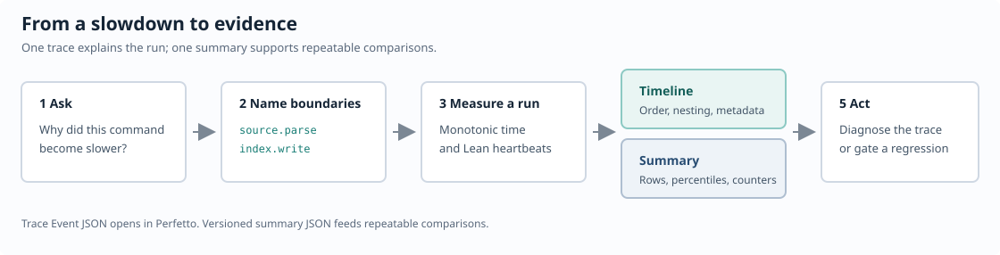
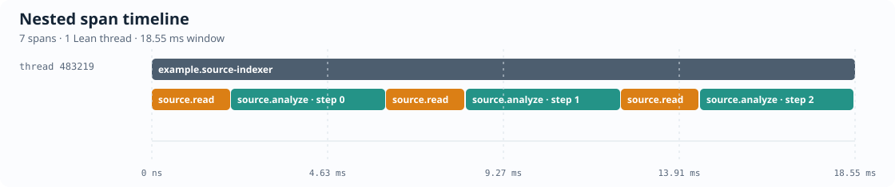
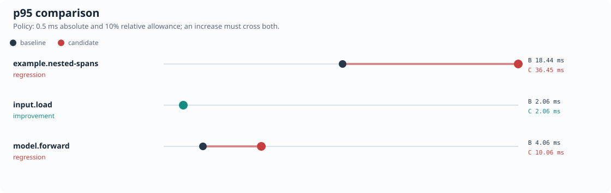

# LeanProfiler

Runtime profiling for Lean programs.

## Why it exists

Lean's compiler profilers are the right tools when a file is slow to elaborate or type-check. Once
an executable starts, a different set of costs appears: reading files, parsing input, running a
search, serving requests, evaluating numerical code, waiting for worker tasks, or calling a foreign
runtime. Timing the whole command confirms that it is slow, but does not show which phase changed.

`IO.timeit` is useful for one measurement, while a system profiler resolves low-level functions.
LeanProfiler records the names that the program gives to its own phases. Each `IO` span keeps its
order, nesting, thread, metadata, elapsed time, Lean heartbeats, and process counters. The result is
a timeline for diagnosis and a summary that can be compared with another run.

The API works in command-line tools, servers, search programs, data pipelines, numerical
applications, and ML workloads. The core package has no dependency on TorchLean, PyTorch, or a
device runtime.

Use the tool that matches the question:

| Question | Tool |
| --- | --- |
| Why is a Lean file slow to elaborate or compile? | Lean's `--profile`, [component profiler](https://lean-lang.org/doc/api/Lean/Util/Profile.html), and [trace profiler](https://lean-lang.org/doc/api/Lean/Util/Trace.html) |
| Which phase of a running Lean executable is slow? | LeanProfiler |
| What happens inside a C, PyTorch, or device call? | The profiler for that runtime, alongside an outer LeanProfiler span |

Each capture produces:

- a Trace Event file that opens in [Perfetto](https://ui.perfetto.dev);
- a strict JSON summary with integer-nanosecond timings, grouped rows, heartbeats, and process
  counters.

The trace is for diagnosis. The summary aggregates repeated work and supports baseline-to-candidate
comparisons in scripts or CI.



## Add it to a project

```toml
[[require]]
name = "LeanProfiler"
git = "https://github.com/lean-dojo/LeanProfiler"
rev = "main"
```

Wrap the work you want to measure:

```lean
import LeanProfiler

open LeanProfiler

def readSource : IO String := do
  IO.sleep 2
  pure "def answer := 42"

def analyzeSource (source : String) : IO Nat := do
  IO.sleep 4
  pure source.length

def main : IO Unit :=
  profileFromEnvironment "indexer.run" do
    let source ← span "source.read" readSource
    let declarations ← span "source.analyze" (analyzeSource source) (metadata := {
      phase := some "analysis"
      moduleName := some "indexer"
    })
    IO.println s!"indexed {declarations} characters"
```

Run it with profiling enabled:

```sh
LEAN_PROFILE=1 lake exe your_executable
```

The default files are:

```text
build/leanprofiler-trace.json
build/leanprofiler-summary.json
```

Use `LEAN_PROFILE_OUT` and `LEAN_PROFILE_SUMMARY_OUT` to keep several runs.
`LEAN_PROFILE_MAX_EVENTS` bounds long captures, and `LEAN_PROFILE_PROCESS_NAME` changes the process
label shown in Perfetto.

Without `LEAN_PROFILE=1`, the same action runs without retaining spans or writing reports.

The umbrella import contains the runtime API, report writers, schedules, and summary comparison.
Three narrower features use explicit imports:

```lean
import LeanProfiler.Syntax  -- `profiled def`
import LeanProfiler.CLI     -- embeddable command router
import LeanProfiler.Proofs  -- laws about schedules, comparisons, and timing analysis
```

Most applications need only `import LeanProfiler`. Keeping the command syntax separate avoids
loading Lean's compiler front end into an ordinary runtime executable.

## Try the examples

```sh
LEAN_PROFILE=1 lake exe leanprofiler_nested_example
LEAN_PROFILE=1 lake exe leanprofiler_async_example
LEAN_PROFILE=1 lake exe leanprofiler_schedule_example
lake exe leanprofiler_regression_example
```

The examples cover nested metadata, asynchronous completion, scheduled active steps, and a complete
baseline-to-regression walkthrough.

## What the output looks like



The timeline shows the order, duration, and nesting of every recorded span.



The comparison plot makes changed p95 timings visible before you inspect the JSON report.

## Compare summaries

```sh
lake exe leanprofiler compare \
  build/baseline-summary.json \
  build/candidate-summary.json \
  --metric p95_ns \
  --absolute-tolerance 500000 \
  --relative-tolerance-bps 1000 \
  --json build/comparison.json
```

A candidate increase is a regression only when it exceeds both tolerances. New and missing keys
are reported separately. Invalid or incomplete summaries are rejected unless the caller requests a
diagnostic comparison.

## Optional TorchLean integration

TorchLean is one application of the general API. TorchLean programs can import the core package
directly, while a separate package provides a command runner, CUDA hooks, and an MLP walkthrough:

```sh
cd integrations/TorchLean
lake build
lake test
LEAN_PROFILE=1 lake exe leanprofiler_torchlean_mlp
```

The runner also has a CUDA adapter. It rejects CPU parity stubs, waits for the selected device
before closing the command span, and records TorchLean device-buffer counters:

```sh
LEAN_PROFILE=1 \
lake -R -K cuda=true exe leanprofiler_torchlean \
  quickstart_mlp --device cuda --steps 3
```

See [the integration README](integrations/TorchLean/README.md).

## Guide

The [published Verso guide](https://lean-dojo.github.io/LeanProfiler/) follows one real slowdown
investigation from instrumentation through its timeline, summary, diagnosis, and regression check.
It also explains sessions, hooks, repeated capture schedules, Lean's elaboration profilers,
PyTorch Profiler, and TorchLean on CPU and CUDA.

Build it locally:

```sh
cd guide
lake exe leanprofiler-guide-assets
lake exe leanprofiler-guide --output build/guide
```

The rendered site is under `guide/build/guide/html-multi`.

The checked-in JSON captures are real observations. The SVG figures are regenerated from those
artifacts by Lean code.

## Tests

```sh
lake test
lake lint
```

The TorchLean package has its own test driver under `integrations/TorchLean`.

## Team and license

Maintained by the LeanProfiler Team. Released under the [MIT license](LICENSE).
